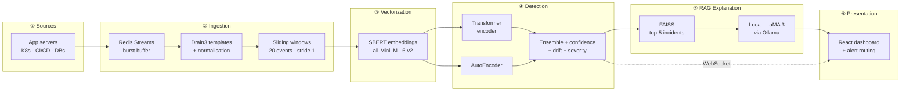

<div align="center">

# 🛡️ LogGuard

### Real-time log anomaly detection with RAG-powered root cause analysis

*Catch failures **before** they cascade - an ensemble of deep-learning models watches your logs in real time, and a local LLaMA 3 explains every anomaly in plain English with a recommended fix.*

<br/>

[](https://www.python.org/)
[](https://fastapi.tiangolo.com/)
[](https://pytorch.org/)
[](https://react.dev/)
[](https://www.typescriptlang.org/)
[](https://www.docker.com/)

<br/>


</div>

---

## 📖 Table of Contents

<details open>
<summary><b>Click to expand / collapse</b></summary>

- [Why LogGuard](#-why-logguard)
- [Key Features](#-key-features)
- [Architecture](#-architecture)
- [The Detection Brain](#-the-detection-brain)
- [Tech Stack](#-tech-stack)
- [Results](#-results)
- [Quick Start](#-quick-start)
- [LLaMA / GPU Deployment](#-llama--gpu-deployment)
- [Project Structure](#-project-structure)
- [Documentation](#-documentation)

</details>

---

## 💡 Why LogGuard

Most log-anomaly systems do **one** of these: anomaly detection, failure prediction, uncertainty quantification, or explainability.

**LogGuard does all four in a single pipeline** - and then goes one step further with **RAG-based natural-language root cause** and **severity-routed alerting**.

> When 100,000 log lines hit during a traffic spike, LogGuard buffers them in Redis Streams, groups them into sliding windows, scores each window with a Transformer + AutoEncoder ensemble, and - for every confirmed anomaly - retrieves the most similar past incidents from FAISS and asks a **local** LLaMA 3 to write a postmortem-quality explanation. No log data ever leaves your infrastructure.

---

## ✨ Key Features

| | Feature | What it does |
|---|---|---|
| 🔎 | **Ensemble anomaly detection** | A Transformer encoder (sequence patterns) + an AutoEncoder (distributional drift) vote together - an anomaly that fools one rarely fools both. |
| ⏱️ | **Failure prediction** | The Transformer's second head predicts *minutes-to-failure*, so you get warned before the outage, not after. |
| 🎯 | **Confidence gating** | A calibrated confidence scorer suppresses borderline noise - only high-confidence anomalies page a human. |
| 🧠 | **RAG root cause** | FAISS retrieves the 5 most similar historical incidents; local LLaMA 3 turns them into a plain-English root cause + recommended fix. |
| 🔒 | **Privacy-first** | LLaMA runs locally via Ollama. Log data - often full of PII - **never** touches a third-party API. |
| 📈 | **Drift detection** | Population Stability Index (PSI) on rolling embeddings flags model drift and emits retrain triggers automatically. |
| 🚨 | **Severity-routed alerts** | `critical → PagerDuty`, `warning → Slack`, `info → email` - all behind feature flags for safe dev/staging. |
| 🔁 | **Human-in-the-loop** | Engineer feedback (true/false positive) flows back to build the next training set. |
| ⚡ | **Live dashboard** | React + WebSocket UI with anomaly timeline, per-line attention heatmaps, and streaming LLaMA explanations. |

---

## 🏗️ Architecture

**Six layers, three pipelines.** Logs flow left-to-right; every stage is decoupled by Redis so bursts never drop data.



<div align="center"><i>Detection-to-dashboard latency target: <b>&lt; 1 second</b>. &nbsp;•&nbsp; LLaMA explanation target: <b>&lt; 30 seconds</b>.</i></div>

---

## 🧠 The Detection Brain

<details>
<summary><b>Transformer encoder</b> - sequence-aware anomaly + failure-window prediction</summary>

<br/>

- 4 layers · 8 attention heads · 256-d hidden · dropout 0.1
- Self-attention relates every event in the 20-event window to every other event - not just neighbours
- **Two heads:** binary anomaly classifier + minutes-to-failure regressor
- Saves last-layer attention weights at inference → rendered as per-line heatmaps in the UI
- Trained with AdamW, `lr=2e-4`, cosine schedule, early stop on validation F1 → exported as TorchScript

</details>

<details>
<summary><b>AutoEncoder</b> - reconstruction-error novelty detection</summary>

<br/>

- Symmetric encoder → 64-d bottleneck → decoder, MSE reconstruction loss
- **Trained only on normal sequences** - it reconstructs normal logs perfectly, so anomalies produce high reconstruction error
- Captures the distributional drift that the Transformer's sequence view can miss

</details>

<details>
<summary><b>Ensemble, confidence & severity</b> - turning scores into decisions</summary>

<br/>

- Weighted ensemble: `combined = w₁·transformer + w₂·autoencoder_error`, weights grid-searched on validation F1
- Confidence MLP over `(transformer_score, ae_error, sequence_length, time_of_day)` gates borderline cases
- Deduplication by `(template_hash, source, 60s window)` so one incident ≠ 500 tickets
- Three-tier severity: failure-probability + critical-source → `critical`; high ensemble score → `warning`; else `info`

</details>

---

## 🧰 Tech Stack

<table>
<tr><td valign="top" width="50%">

### Backend & ML


- **Drain3** - log template extraction
- **sentence-transformers** - `all-MiniLM-L6-v2` window embeddings
- **FAISS** - similarity search over past incidents
- **Ollama + LLaMA 3** - local generative root cause

</td><td valign="top" width="50%">

### Frontend


- **TanStack Query** · **React Router** · **Recharts** · **Framer Motion**

### Data & Infra


### Quality & CI


</td></tr>
</table>

---

## 📊 Results

Evaluated on a strict **70 / 15 / 15** split where test slices were held out of **both** training *and* threshold calibration. **Apache logs were never seen by either model** - a genuine cross-dataset generalization test.

<div align="center">

| Metric | OpenStack (test) | Apache (**never seen**) |
|:---|:---:|:---:|
| **F1** | `1.000` | `0.984` |
| **Precision** | `0.894 - 1.000` | `0.994` |
| **Recall** | `0.982 - 1.000` | `0.974` |
| **AUC** | `0.996 - 1.000` | - |

</div>

> The headline result: a model trained purely on **OpenStack** logs still scores **F1 = 0.984** on an entirely unseen **Apache** log format - evidence the Drain3-templating + SBERT pipeline learns *structural* anomaly signatures, not dataset-specific memorisation.
>
> The RAG index is seeded with **18,454** entries (18,434 real anomalies + 20 hand-written synthetic incidents covering OOM, disk-full, connection-pool exhaustion, cert expiry, DNS failure, and more).

<sub>Full methodology and per-model breakdown: `backend/training/RESULTS.md`.</sub>

---

## 🚀 Quick Start

> **Prerequisites:** Docker + Docker Compose, Python 3.11, Node 18+, and (optionally) [Ollama](https://ollama.com/) for the RAG worker.

```bash
# 1. Bring up Redis, Postgres, and Ollama
docker compose up -d

# 2. Train the models (Pipeline 2) - runs once, produces all artifacts
cd backend
python -m training.run_full_pipeline --dataset hdfs

# 3. Start the live system (Pipeline 1)
docker compose up backend rag-worker

# 4. In another terminal - replay logs to drive the demo
python tools/log_replay.py training/data/hdfs/HDFS.log --rate 100 --inject-anomaly

# 5. Launch the dashboard
cd ../frontend
npm install
npm run dev        # → http://localhost:5173
```

Health check once the stack is up:

```bash
curl http://localhost:8000/api/v1/health
```

---

## 🦙 LLaMA / GPU Deployment

The RAG worker calls Ollama on **every** detected anomaly (no precomputed cache short-circuit), so per-call latency is bounded by model + hardware:

<div align="center">

| Model | CPU | GPU |
|:---|:---:|:---:|
| `llama3.2:1b` | ~15-30 s | ~1-2 s |
| `llama3:8b` | ~60-180 s | ~3-5 s |

</div>

Two env vars on the RAG worker control this:

```bash
# Default - talk to the docker-compose Ollama on this machine
LOGGUARD_LLAMA_HOST=http://localhost:11434
LOGGUARD_LLAMA_MODEL=llama3:8b

# CPU-only laptop dev - switch to the smaller model
LOGGUARD_LLAMA_MODEL=llama3.2:1b

# Remote GPU deployment - point at the GPU box's Ollama
LOGGUARD_LLAMA_HOST=http://gpu-box.example:11434
LOGGUARD_LLAMA_MODEL=llama3:8b
```

The remote Ollama must be reachable over HTTP (port `11434`) with the model already pulled (`ollama pull llama3:8b`). `LOGGUARD_LLAMA_TIMEOUT_S` (default `300`) bounds individual call time.

---

## 📁 Project Structure

```
LogGuard/
├── backend/
│   ├── api/            # FastAPI app - routes, WebSocket, upload, persistence
│   ├── ingestion/      # Redis consumer, Drain3 parser, sequence builder
│   ├── ml/             # Transformer, AutoEncoder, ensemble, drift, postprocess
│   ├── rag/            # FAISS client, LLaMA client, prompt templates, explainer
│   ├── training/       # Full training + evaluation pipeline
│   ├── tools/          # Log replayer for demos
│   └── tests/          # pytest suite (unit + integration)
├── frontend/           # React + Vite + TypeScript dashboard
├── docs/architecture/  # System overview, pipelines, API contract, RAG design
├── docker-compose.yml  # Redis · Postgres · Ollama · backend
└── .github/workflows/  # CI - ruff, mypy, pytest
```

---

## 📚 Documentation

| Doc | Contents |
|:---|:---|
| [`system_overview.md`](docs/architecture/system_overview.md) | Full six-layer technical walkthrough |
| [`pipelines.md`](docs/architecture/pipelines.md) | The three pipelines (live · training · RAG) |
| [`api_contract.md`](docs/architecture/api_contract.md) | REST + WebSocket API contract |
| [`training_pipeline.md`](docs/architecture/training_pipeline.md) | Data prep → embed → train → calibrate → eval |
| [`rag_design.md`](docs/architecture/rag_design.md) | Prompt templates and example LLaMA outputs |

---

<div align="center">

**Built with ❤️ for reliable systems.**

<sub>Detect early · Explain clearly · Alert precisely</sub>

</div>
